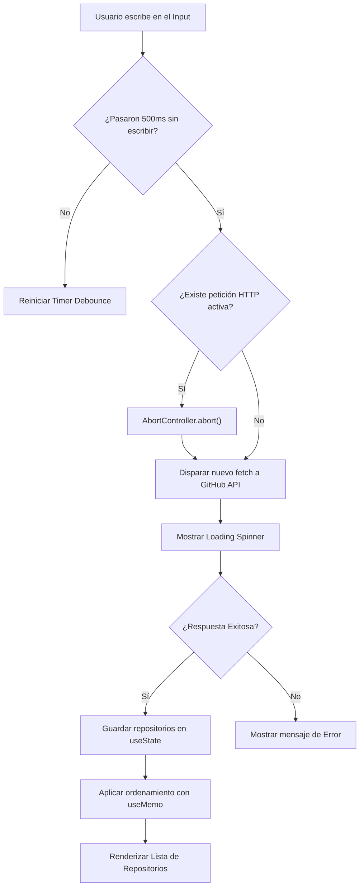

# 🔍 Explorador de Repositorios de GitHub

> 🌐 **Language / Idioma:** [English](./README.md) | **Español**

Un buscador interactivo de repositorios públicos de GitHub. La aplicación permite a cualquier usuario escribir una palabra clave, consultar la API en tiempo real, obtener una **lista de proyectos relacionados** y **ordenar los resultados al instante** (por popularidad o fecha) con un rendimiento optimizado.

---

## 💡 ¿Qué hace esta aplicación? (Visión General)

1. **Búsqueda por palabras clave:** El usuario escribe un tema, tecnología o nombre (ej: `react`, `ecommerce`, `python`).
2. **Obtención de lista de proyectos:** La app consulta la API oficial de GitHub y devuelve una **lista de repositorios** que coinciden con la búsqueda.
3. **Visualización limpia:** Cada proyecto de la lista se muestra en una tarjeta individual (`RepoCard`) con sus datos clave:
   - Nombre del repositorio y dueño.
   - Descripción del proyecto.
   - Cantidad de estrellas (⭐) e idioma principal.
   - Fecha de última actualización.
   - Enlace directo para abrir el proyecto en GitHub.
4. **Ordenamiento dinámico:** El usuario puede reordenar la lista devuelta en tiempo real por **más estrellas** o **más reciente**, sin necesidad de volver a hacer una consulta a la red.

---

## 🚀 Demo y Vista Previa

- **Demo en vivo:** [Link a Vercel/Netlify o vps](#) _(Próximamente)_
- **Vista Previa:**

 _(La reemplazare por captura de pantalla al finalizar)_

---

## 🛠️ Stack Tecnológico

- **Core:** React 18+
- **Build Tool:** Vite
- **Lenguaje:** JavaScript (ES6+)
- **Estilos:** CSS3 / Vanilla CSS o Tailwind
- **API External:** GitHub REST API v3

---

## 🎯 Problema Técnico a Resolver

Llamar a una API externa en cada pulsación de tecla (`onChange`) en un campo de texto genera sobrecarga en la red, agota la cuota gratuita del servidor (_rate limits_ de 60 req/hora sin autenticar) y produce carreras de tiempo (_race conditions_) en la interfaz de usuario.

---

## 🛠️ Solución Técnica y Conceptos de React

1. **Debounce Nativo (`useCallback` / `useEffect`):** Postergación de la ejecución hasta 500 ms después de que el usuario deja de escribir.
2. **Cancelación de Peticiones (`useEffect` + `AbortController`):** Abortar peticiones pendientes en memoria si el usuario modifica la búsqueda antes de recibir respuesta.
3. **Ordenamiento en Memoria (`useMemo`):** Reordenamiento dinámico de los repositorios recibidos (por Estrellas o Última Actualización) sin realizar nuevas consultas de red.
4. **Gestión de Estado (`useState`):** Control del término de búsqueda, lista de resultados, estados de carga (_loading_) y captura de errores HTTP.

---

## 📊 Diagrama de Flujo (Flowchart)



---

## 🏗️ Arquitectura de Componentes

```text
src/
├── components/
│ ├── SearchBar.jsx # Input de búsqueda
│ ├── SortControls.jsx # Selectores de ordenamiento
│ ├── RepoList.jsx # Lista contenedora
│ ├── RepoCard.jsx # Tarjeta individual del repositorio
│ └── StatusState.jsx # Manejo de Loading / Errors
├── hooks/
│ ├── useDebounce.js # Lógica personalizada de debounce
│ └── useGithubSearch.js # Lógica de consumo de API + AbortController
├── services/
│ └── githubApi.js # Configuración del fetch a GitHub
└── App.jsx # Integración del estado y componentes
```

---

## ⚙️ Instalación y Configuración Local

Sigue estos pasos para ejecutar el proyecto en tu máquina local:

**Clonar el repositorio:**

```
git clone https://github.com/NicoPaez95/github-explorer.git
cd github-explorer
```

**Instalar dependencias:**

```bash
npm install
```

**Variables de Entorno (Opcional pero recomendado):**

Para evitar el límite de 60 peticiones/hora de la API pública de GitHub, podés crear un archivo .env.local en la raíz basado en .env.example:

```env
VITE_GITHUB_TOKEN=tu_personal_access_token
```

Iniciar el servidor de desarrollo:

```bash
npm run dev
```

Abre http://localhost:5173 en tu navegador.

## 📋 Criterios de Aceptación (Roadmap)

- [ ] **Búsqueda por coincidencia:** El usuario debe poder tipear en un `<input />` para buscar repositorios.

- [ ] **Espera inteligente (Debounce):** La API solo se consulta tras 500 ms de inactividad.

- [ ] **Manejo de asincronía:**
  - [ ] Mostrar LoadingSpinner durante la consulta.

  - [ ] Mostrar mensajes descriptivos ante errores (403 Rate Limit, 404 Sin resultados, etc.).

  - [ ] Ordenamiento dinámico: Permitir ordenar los resultados por Estrellas o Fecha de actualización en memoria.

- [ ] **Visualización de resultados:** Cada repositorio se muestra en una tarjeta (`RepoCard`) con nombre, dueño, descripción, estrellas, lenguaje, fecha de actualización y enlace a GitHub.

---

📄 Licencia
Este proyecto está bajo la Licencia MIT.
