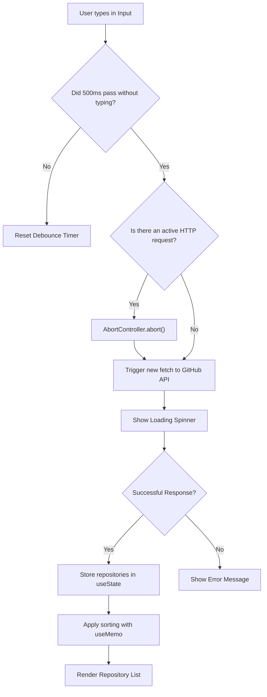

# 🔍 GitHub Repository Explorer

> 🌐 **Language / Idioma:** **English** | [Español](./README.es.md)

An interactive search tool for public GitHub repositories. The application allows any user to type a keyword, query the API in real time, get a **list of related projects**, and **instantly sort the results** (by popularity or date) with optimized performance.

---

## 💡 What does this application do? (Overview)

1. **Keyword search:** The user types a topic, technology, or name (e.g., `react`, `ecommerce`, `python`).
2. **Fetching the project list:** The app queries the official GitHub API and returns a **list of repositories** matching the search.
3. **Clean visualization:** Each project in the list is displayed in an individual card (`RepoCard`) with key details:
   - Repository name and owner.
   - Project description.
   - Star count (⭐) and primary language.
   - Last updated date.
   - Direct link to open the project on GitHub.
4. **Dynamic sorting:** The user can reorder the returned list in real time by **most stars** or **most recent**, without needing to make a new network request.

---

## 🚀 Demo & Preview

- **Live demo:** [Link to Vercel/Netlify or VPS](#) _(Coming soon)_
- **Preview:**

 _(Will be replaced with a real screenshot upon completion)_

---

## 🛠️ Tech Stack

- **Core:** React 18+
- **Build Tool:** Vite
- **Language:** JavaScript (ES6+)
- **Styling:** CSS3 / Vanilla CSS or Tailwind
- **External API:** GitHub REST API v3

---

## 🎯 Technical Problem to Solve

Calling an external API on every keystroke (`onChange`) in an input field causes network overhead, exhausts the server's free-tier rate limit (60 req/hour when unauthenticated), and produces race conditions in the user interface.

---

## 🛠️ Technical Solution & React Concepts

1. **Native Debounce (`useCallback` / `useEffect`):** Delaying execution until 500 ms after the user stops typing.
2. **Request Cancellation (`useEffect` + `AbortController`):** Aborting pending requests in memory if the user changes the search before receiving a response.
3. **In-Memory Sorting (`useMemo`):** Dynamic reordering of the fetched repositories (by Stars or Last Updated) without making new network requests.
4. **State Management (`useState`):** Controlling the search term, results list, loading states, and HTTP error capturing.

---

## 📊 Flowchart & State Logic



---

## 🏗️ Component Architecture

```text
src/
├── components/
│ ├── SearchBar.jsx      # Search input
│ ├── SortControls.jsx   # Sorting dropdowns
│ ├── RepoList.jsx       # Container list
│ ├── RepoCard.jsx       # Individual repository card
│ └── StatusState.jsx    # Loading / Error handling
├── hooks/
│ ├── useDebounce.js     # Custom debounce logic
│ └── useGithubSearch.js # Fetching logic + AbortController
├── services/
│ └── githubApi.js       # GitHub API fetch configuration
└── App.jsx               # State integration & main layout
```

---

## ⚙️ Local Installation & Setup

Follow these steps to run the project on your local machine:

**Clone the repository:**

```
git clone https://github.com/NicoPaez95/github-explorer.git
cd github-explorer
```

**Install dependencies:**

```bash
npm install
```

**Environment Variables (Optional but recommended):**

To avoid the 60 requests/hour limit of the public GitHub API, you can create a `.env.local` file at the project root based on `.env.example`:

```env
VITE_GITHUB_TOKEN=your_personal_access_token
```

Start the development server:

```bash
npm run dev
```

Open http://localhost:5173 in your browser.

## 📋 Acceptance Criteria (Roadmap)

- [ ] **Keyword search:** Users can type in an `<input />` to search repositories.

- [ ] **Smart delay (Debounce):** The API is only queried after 500 ms of inactivity.

- [ ] **Asynchronous handling:**
  - [ ] Show a LoadingSpinner while the query is in progress.

  - [ ] Show descriptive error messages (403 Rate Limit, 404 No results, etc.).

  - [ ] Dynamic sorting: Allow sorting results by Stars or Last Updated in memory.

- [ ] **Result visualization:** Each repository is displayed in a card (`RepoCard`) with name, owner, description, stars, language, last updated date, and a link to GitHub.

---

📄 License
This project is licensed under the MIT License.
